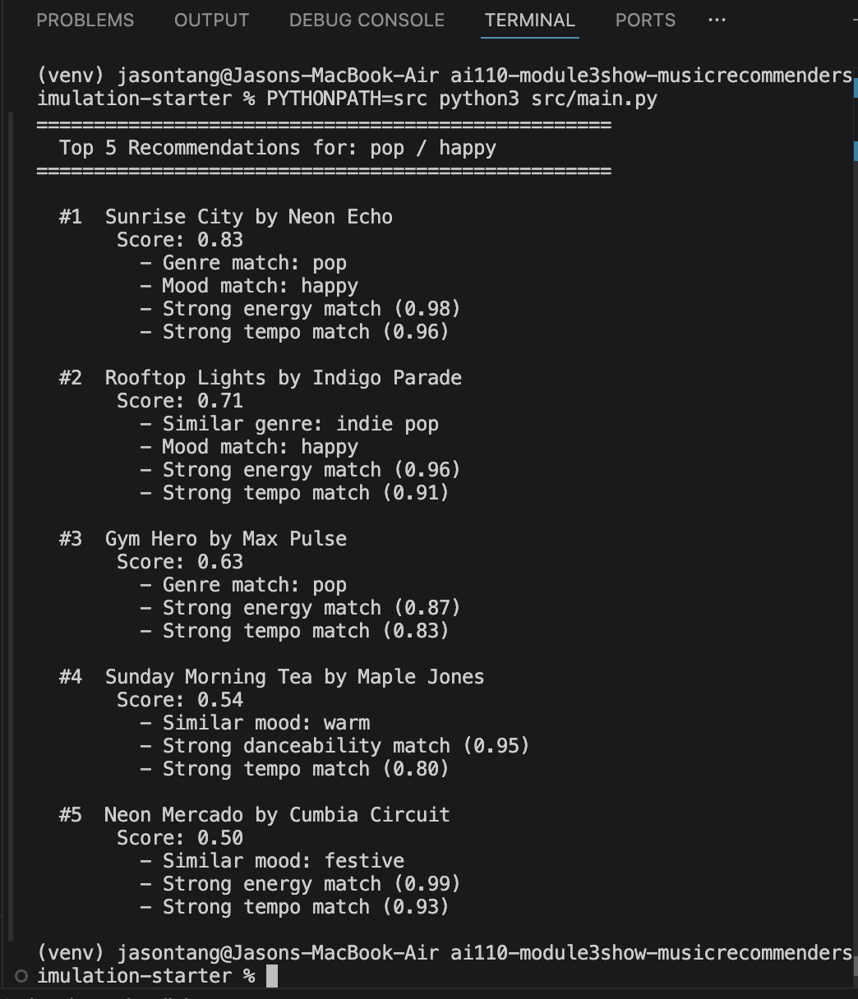

# 🎵 Music Recommender Simulation

## Project Summary

In this project you will build and explain a small music recommender system.

Your goal is to:

- Represent songs and a user "taste profile" as data
- Design a scoring rule that turns that data into recommendations
- Evaluate what your system gets right and wrong
- Reflect on how this mirrors real world AI recommenders

Replace this paragraph with your own summary of what your version does.

---

## How The System Works

Real-world music platforms like Spotify and YouTube Music predict what listeners will enjoy using two main strategies.

Collaborative filtering looks at the behavior of millions of users - what they save, skip, and playlist together - to find people with similar taste and recommend what those similar listeners loved. Content-based filtering takes a different approach: it analyzes measurable attributes of each song and matches them against a user's preferences. Most production systems combine both in hybrid-systems, but this project focuses on a pure content-based approach.

### Data Representation

Each **Song** carries seven scorable features:

| Feature | Type | Scale |
|---|---|---|
| `genre` | categorical | e.g. pop, lofi, rock |
| `mood` | categorical | e.g. happy, chill, intense |
| `energy` | numerical | 0.0 – 1.0 |
| `tempo_bpm` | numerical | 60 – 168 (normalized to 0–1) |
| `valence` | numerical | 0.0 – 1.0 |
| `danceability` | numerical | 0.0 – 1.0 |
| `acousticness` | numerical | 0.0 – 1.0 |

The **UserProfile** stores a listener's taste:
- `favorite_genre` and `favorite_mood` (categorical targets)
- `target_energy`, `target_valence`, `target_danceability`, `target_tempo` (numerical targets, 0–1)
- `likes_acoustic` (boolean preference)

### Algorithm Recipe

The recommender uses a **Vibe-Balanced** weighted scoring strategy. Each song is scored against the user's preferences, and the top K highest-scoring songs are returned as recommendations.

**Weights (sum to 1.0):**

| Feature | Weight | Rationale |
|---|---|---|
| genre | 0.25 | Strongest single signal, but not a dealbreaker |
| mood | 0.15 | Important for vibe, but secondary to genre |
| energy | 0.15 | Core "feel" of a song |
| danceability | 0.12 | How the song makes you move |
| valence | 0.12 | Emotional positivity/negativity |
| acousticness | 0.11 | Acoustic vs. electronic texture |
| tempo | 0.10 | Pace of the song |

Genre is the highest-weighted individual feature (0.25), but the five numerical features collectively sum to 0.60 — meaning a song that nails the vibe but misses on genre can still rank well.

**Scoring rules per feature:**

- **Genre and Mood (tiered matching):**
  - Exact match = 1.0
  - Same family = 0.5 (e.g. "indie pop" when user prefers "pop")
  - Unrelated = 0.0

  Genre families: {pop, indie pop}, {lofi, ambient}, {rock, metal}, {synthwave, electronic, darkwave, house}, {jazz, soul, blues}, {folk, classical}, {latin}, {emo}

  Mood families: {chill, relaxed, peaceful}, {happy, euphoric, festive, warm}, {intense, aggressive, energetic}, {moody, melancholy, sad, dark}, {focused, nostalgic}

- **Energy, Danceability, Valence (proximity):** `1 - abs(song_value - user_target)`
- **Tempo (normalized proximity):** Normalize BPM to 0–1 via `(bpm - 60) / 108`, then `1 - abs(normalized_tempo - user_target)`
- **Acousticness (boolean preference):** If `likes_acoustic = True`, score = song's acousticness. If `False`, score = `1 - acousticness`.

**Final score** = weighted sum of all feature scores (result is 0.0 – 1.0).

**Explanation format:** Each recommendation includes an explanation that mentions any matched categorical features (exact or family match), plus the top 2 highest-scoring numerical features.

### Data Flow

```
Input (User Prefs + Song CSV)
  → Process (Loop: score every song using the recipe above)
    → Output (Sort by score descending, return top K)
```

### Expected Biases

- **Genre label bias:** The similarity map is hand-curated. Genres not placed in a family (e.g. "latin", "emo") can never receive partial credit, even if a listener might consider them related to other genres. The families reflect the developer's subjective judgment, not a universal standard.
- **Popularity blindness:** The system has no concept of song popularity, play count, or social proof. A niche song that matches the profile numerically will rank equally to a well-known hit with the same scores.
- **Acoustic boolean oversimplification:** Real acoustic preference exists on a spectrum, but `likes_acoustic` is binary. A user who enjoys *moderately* acoustic music (e.g. 0.4–0.6) has no way to express that — they either boost or penalize acousticness entirely.
- **High-energy and high-danceability bias:** Users who prefer mid-range values (e.g. energy around 0.5) will find that many songs score reasonably well because the proximity formula is more forgiving near the center of the 0–1 range. Users at the extremes (very low or very high) get sharper differentiation.
- **Small catalog effects:** With only 20 songs, a single genre may have just 1–2 representatives. A user whose favorite genre has few songs in the catalog will see unrelated genres fill out their top K, which may feel like poor recommendations.

### Potential Edge Cases

- **Tied scores:** Two songs with identical final scores have no tiebreaker — their order depends on their position in the CSV. This could matter when K is small.
- **No genre or mood match in catalog:** If the user's favorite genre has zero songs (exact or family), genre contributes 0.0 for every song, effectively removing 25% of the scoring range. The recommendations will be driven entirely by numerical features.
- **All-acoustic or no-acoustic catalog:** If every song has acousticness near 1.0 or 0.0, the acousticness feature stops differentiating and its 0.11 weight is essentially wasted.

---

## Getting Started

### Setup

1. Create a virtual environment (optional but recommended):

   ```bash
   python -m venv .venv
   source .venv/bin/activate      # Mac or Linux
   .venv\Scripts\activate         # Windows

2. Install dependencies

```bash
pip install -r requirements.txt
```

3. Run the app:

```bash
python -m src.main
```

### Running Tests

Run the starter tests with:

```bash
pytest
```

You can add more tests in `tests/test_recommender.py`.

---

## Experiments You Tried

Use this section to document the experiments you ran. For example:


- What happened when you changed the weight on genre from 2.0 to 0.5
- What happened when you added tempo or valence to the score
- How did your system behave for different types of users

---

## Limitations and Risks

Summarize some limitations of your recommender.

Examples:

- It only works on a tiny catalog
- It does not understand lyrics or language
- It might over favor one genre or mood

You will go deeper on this in your model card.

---

## Reflection

Read and complete `model_card.md`:

[**Model Card**](model_card.md)

Write 1 to 2 paragraphs here about what you learned:

- about how recommenders turn data into predictions
- about where bias or unfairness could show up in systems like this


---

## 7. `model_card_template.md`

Combines reflection and model card framing from the Module 3 guidance. :contentReference[oaicite:2]{index=2}  

```markdown
# 🎧 Model Card - Music Recommender Simulation

## 1. Model Name

Give your recommender a name, for example:

> VibeFinder 1.0

---

## 2. Intended Use

- What is this system trying to do
- Who is it for

Example:

> This model suggests 3 to 5 songs from a small catalog based on a user's preferred genre, mood, and energy level. It is for classroom exploration only, not for real users.

---

## 3. How It Works (Short Explanation)

Describe your scoring logic in plain language.

- What features of each song does it consider
- What information about the user does it use
- How does it turn those into a number

Try to avoid code in this section, treat it like an explanation to a non programmer.

---

## 4. Data

Describe your dataset.

- How many songs are in `data/songs.csv`
- Did you add or remove any songs
- What kinds of genres or moods are represented
- Whose taste does this data mostly reflect

---

## 5. Strengths

Where does your recommender work well

You can think about:
- Situations where the top results "felt right"
- Particular user profiles it served well
- Simplicity or transparency benefits

---

## 6. Limitations and Bias

Where does your recommender struggle

Some prompts:
- Does it ignore some genres or moods
- Does it treat all users as if they have the same taste shape
- Is it biased toward high energy or one genre by default
- How could this be unfair if used in a real product

---

## 7. Evaluation

How did you check your system

Examples:
- You tried multiple user profiles and wrote down whether the results matched your expectations
- You compared your simulation to what a real app like Spotify or YouTube tends to recommend
- You wrote tests for your scoring logic

You do not need a numeric metric, but if you used one, explain what it measures.

---

## 8. Future Work

If you had more time, how would you improve this recommender

Examples:

- Add support for multiple users and "group vibe" recommendations
- Balance diversity of songs instead of always picking the closest match
- Use more features, like tempo ranges or lyric themes

---

## 9. Personal Reflection

A few sentences about what you learned:

- What surprised you about how your system behaved
- How did building this change how you think about real music recommenders
- Where do you think human judgment still matters, even if the model seems "smart"

